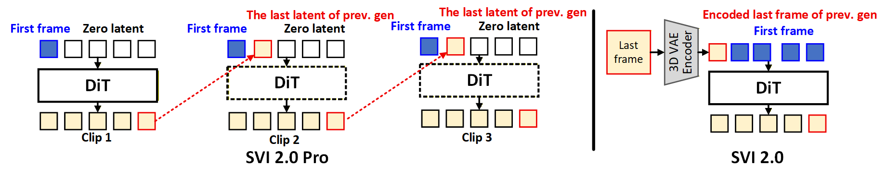

### [10 Dec 2025] Difference of SVI 2.0 Pro

Compared with **SVI 2.0**, this **Pro version** introduces three key improvements:

1. **Anchor Redesign**  
   Redesigned the anchor frame mechanism to potentially alleviate its conflict with the **lightx2v LoRA**. We use the anchor frame (the user‑provided first frame) as the first latent instead of padding it across all 80 positions.

2. **Latent Conditioning**  
   Replaces the last-frame conditioning with **last-latent conditioning**, avoiding repeated encoding/decoding of the last frames.

3. **Data Scaling**  
   Expands the training set by adding additional videos generated from closed-source models, improving data diversity and robustness.

The architectural design is as follows. For each generation, the input latent is the concatation of:

- the **first-frame latent** (shared across all clips),
- the **last latent from the previous clip**,
- followed by **zero-value latents**.

  

The code implementation is [here](https://github.com/vita-epfl/Stable-Video-Infinity/blob/7dac0f92e14300ab4cbb2e1499d95a90692b9bc1/diffsynth/pipelines/wan_video_svi_pro.py#L522) with `y = torch.concat([anchor_latent, motion_latent, padding], dim=1)`, where `anchor_latent` is the latent of user‑provided first frame, `motion_latent` is the last entry of the previously generated video latent, and the remaining `padding` is zero‑valued (this is a zero‑valued latent rather than an encoded zero‑valued image).
